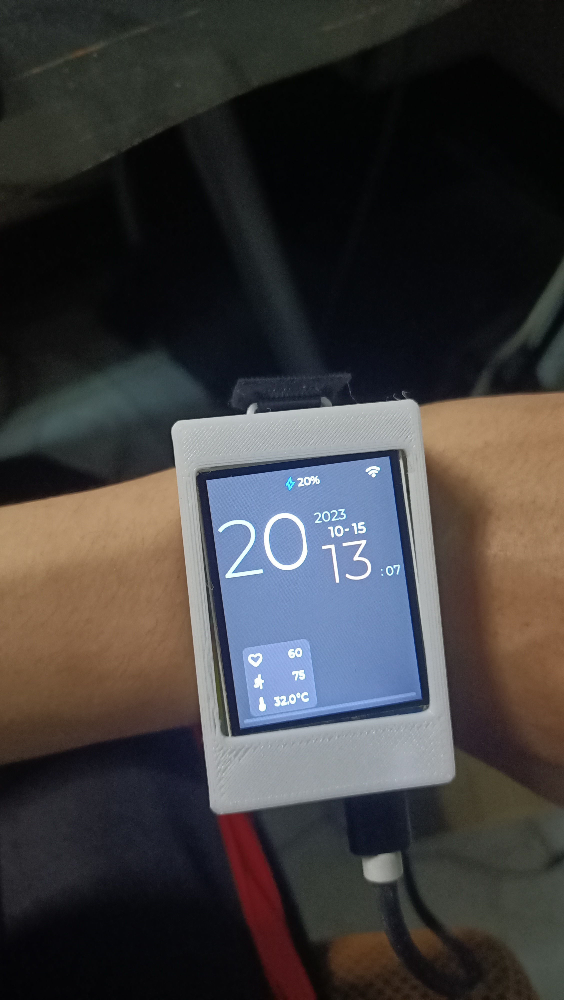
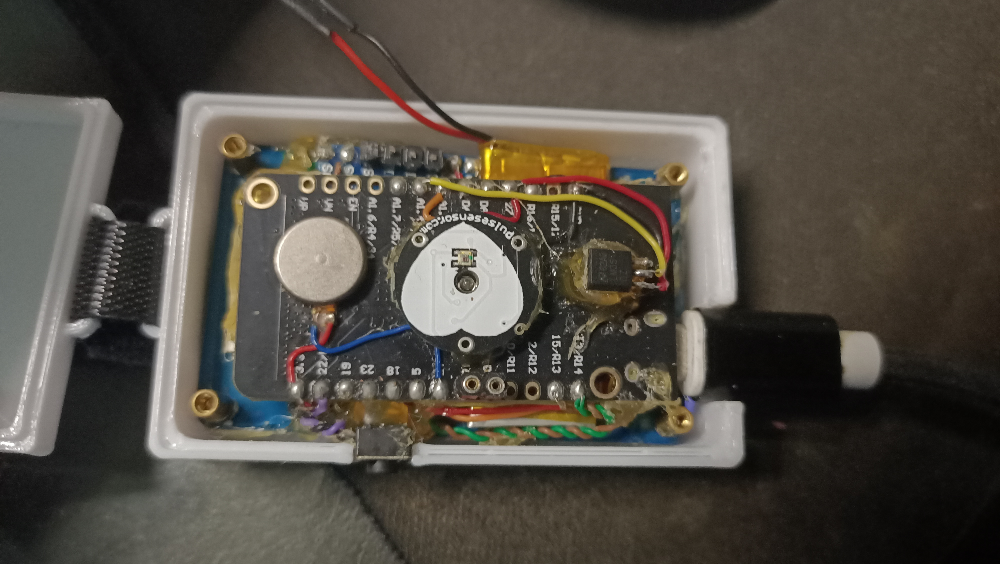
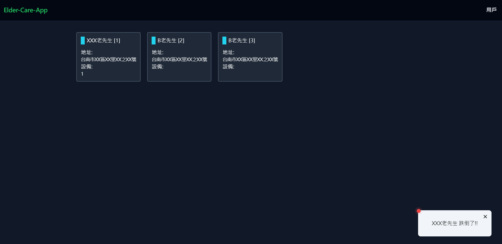
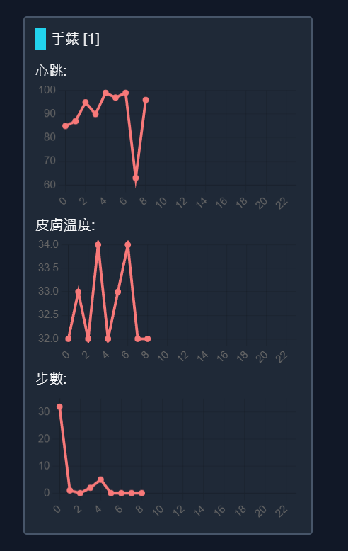

# Elder Care App

一個結合 IoT 智慧手錶、後端 API 與前端管理介面的長照（Elder Care）專案範例。

本專案包含三個主要部分：

- `watch`：韌體與硬體相關程式（基於 PlatformIO / Arduino / ESP32）
- `server`：Node/TypeScript 後端 API（Express + TypeScript）
- `frontend`：Nuxt 3 前端介面（Vue 3 + TailwindCSS）

以下 README 已合併專案說明、目的、功能清單、快速上手與實作細節（中文）。

## 摘要

台灣老年化的趨勢越來越明顯，老人的長照問題是不能忽略的，儘管政府努力的想辦法增加照護人員，但還是有很多的獨居老人無法及時獲得照護和協助，本項目以老人的照護為主軸，嘗試開發更為簡易的協助設備，使政府可以減少是更多的人力來照護。

很多時候家中長者都死於心臟、跌倒等問題，如何及早發現是一個很大的問題。

[](./assets/圖片/新照片/IMG20231015201307.jpg)
[](./assets/圖片/新照片/IMG20231015201355.jpg)
[](./assets/圖片/新照片/螢幕擷取畫面_2023-10-15_215911.png)
[](./assets/圖片/新照片/螢幕擷取畫面_2023-10-15_220002.png)

## 目的

本項目想要完成以下的目的

1. 時時監測長者的身體狀況，包含心跳/體溫等等
2. 監測長者是否發生跌倒等意外情況
3. 監測長者家中的環境使否安全（包含溫溼度/空氣品質/有害氣監測等）
4. 提供長者可一鍵通知他人的緊急按鈕
5. 連結家中其它的設備，提供更全面的保護（如電路系統、固定式緊急按鈕、血氧機等）

## 項目功能（功能清單與說明）

以下為本專案計畫實作或規劃的重要功能，分為「裝置端（watch）」、「後端（server）」、「前端（dashboard）」與「整合/運維」四大面向：

- 裝置端（手錶 / IoT 裝置）

  - 即時生理監測：持續量測心跳（HR）、心率變異（HRV, 若可）、體溫（或皮溫）、步數等數值。
  - 跌倒偵測：使用三軸加速度計（ADXL345）分析突發加速度與角度變化，自動判定可能跌倒並觸發警報上報。
  - 緊急求救（SOS）：硬體按鍵或螢幕按鈕一鍵發送 SOS，含使用者 ID、裝置 ID 與當下狀態上報至 server。
    長者照護整合專案（Elder Care App）

  一個包含穿戴裝置韌體（ESP32 / PlatformIO）、後端（Node.js + TypeScript）與前端（Nuxt 3 / Vue）三層的長者照護原型專案。

  本檔以中文說明專案結構、快速啟動、目前功能實作狀態（已實作 / 部分 / 未實作）與開發者注意事項，方便團隊協作與後續開發。

  ***

  ## 目錄

  - 專案概觀
  - 系統組成（watch / server / frontend）
  - 快速啟動（使用 yarn）
  - 功能狀態（已實作 / 部分 / 未實作）
  - 開發說明與重要檔案位置
  - 建議的下一步

  ***

  ## 專案概觀

  此專案示範一條從穿戴裝置到雲端與前端的「感測 → 上報 → 存放 → 即時推播」流程。穿戴裝置（watch）負責量測心率、加速度（跌倒 / 計步）、並透過 Wi‑Fi 回報 warn 訊息；伺服器接收裝置上報並把警示資料存入 device model，且透過 WebSocket 廣播 warn 事件給前端及第三方通知（如 LINE）。

  技術棧：

  - watch：PlatformIO / Arduino (ESP32)、C++
  - server：Node.js + TypeScript、Express 等
  - frontend：Nuxt 3 (Vue 3)、Tailwind

  ***

  ## 系統組成與主要路徑

  - 根目錄
    - `watch/` : 裝置韌體（PlatformIO 專案）
      - `src/`、`lib/`、`include/` 等
    - `server/` : 後端伺服器（TypeScript）
      - `src/router/api/devices.ts`：處理裝置上傳資料與 warn 邏輯
      - `src/index.ts`：WebSocket 廣播 `warn` 事件
      - `src/models/device.ts`：device schema 與 `warn` 欄位
    - `frontend/`: Nuxt 前端專案（展示與警示 UI）

  ***

  ## 快速啟動（以 yarn 為例）

  請在各子專案目錄下執行：

  1. 後端（server）

  ```powershell
  cd d:\codes\fork\Elder-Care-App\server
  yarn install
  yarn dev
  ```

  2. 前端（frontend）

  ```powershell
  cd d:\codes\fork\Elder-Care-App\frontend
  yarn install
  yarn dev
  ```

  3. 裝置韌體（watch）

  - 使用 PlatformIO / VSCode 開啟 `watch` 專案，連上開發板並上傳。
  - 若要在真機上測試 Wi‑Fi 與伺服器互動，請先確保 server 可供裝置存取（例如在同一網段，或使用 ngrok / 內網穿透）。

  > 備註：本專案以 `yarn` 作為建置/啟動範例，請在需要時改成對應系統的容器或 Docker Compose 指令。

  ***

  ## 功能狀態總覽（依程式碼檢視所得，2025-11-03）

  已實作（有程式碼與呼叫流程）：

  - 心率量測 (Pulse / BPM)：Implemented
    - 證據：`watch/lib/PulseSensor/*`、`watch/src/main.cpp`（PulseSensor 實例與 BPM 計算）。
  - 跌倒偵測 (Fall Detection)：Implemented
    - 證據：`watch/lib/FallDetection/*`、`watch/src/main.cpp`（fallDetection.loop(...) 與 handler 呼 postJson warn）。
  - 計步 (Step Count)：Implemented
    - 證據：`watch/lib/StepCount/*` 與 `watch/src/main.cpp` 的 step.loop(...)。
  - Wi‑Fi / 設定門戶 / SPIFFS 設定：Implemented
    - 證據：`watch/src/network.cpp`（AP/STA、scan、SPIFFS 讀寫、config portal）。
  - NTP 同步：Implemented（自動同步）
    - 證據：`watch/src/network.cpp` 中 `autoUpdateNTP()`，main.cpp 呼叫。
  - 裝置上報 warn → 伺服器處理：Implemented
    - 證據：`server/src/router/api/devices.ts`（處理 warn: heartbeat/temp/fall/env 並寫入 device.warn），`server/src/models/device.ts`。
  - 即時推播 warn（WebSocket 廣播）：Implemented
    - 證據：`server/src/index.ts`（對外 WebSocket，emit 'warn' 並傳送 JSON `{ event: 'warn', data: ... }`）。
  - LINE 通知整合（程式碼位）：Implemented（有整合呼叫）
    - 證據：`server/src/index.ts`（包含呼叫 LINE notify 的程式片段）。

  部分實作 / 需要驗證（程式碼存在但需執行驗證或 UI 優化）：

  - 前端即時 UI 與警示顯示：Partial
    - 證據：`frontend/type.ts`、`frontend/stores/alarmMap.ts`、多個 pages/components 存在，但未在本次檢視中進行 runtime 驗證。需要啟動前端並透過 WebSocket 測試告警流程以確認 UX。
  - 多人/群組管理、進階使用者介面：Partial
    - 證據：server 有 users model 與 users router、frontend 有 users page，但完整的群組管理流程與權限未驗證或尚未完整 UI。

  未實作 / 未發現明確實作證據：

  - 真正的 OTA 韌體更新完整流程（watch 從 server 下載並驗證、更新）：Not Implemented
    - 原因：雖然 `.vscode/settings.json` 與 platformio/esp32 include path 有關 OTA 的 header 路徑，但在 watch 原始碼內尚未看到明確從 server 下載並啟動更新的端到端流程。
    - 建議：若要支援 OTA，需要在 watch 端實作 HTTPS 更新 (esp_https_ota 或 Update library)，並在 server 端提供已簽名/版本化的固件資源。
  - SMS / 電話（語音）通知整合：Not Implemented
    - 目前只看到 LINE notify 的程式碼片段；無 SMS / 電話 API（如 Twilio）整合程式碼。
  - 進階生理訊號分析 (HRV、偽陽性濾除)：Not Implemented
    - PulseSensor 提供 BPM，但沒有 HRV 分析或伺服器端的長期健康分析管線。
  - 健康報表 / 長期行為分析引擎：Not Implemented

  ***

  ## 開發與重要檔案備忘

  - Watch（韌體）

    - `watch/src/main.cpp` — 程式入口，整合 pulse、step、fall 的 loop，並呼叫 `postJson` 發送 warn。
    - `watch/src/network.cpp` — Wi‑Fi 管理、config portal、NTP 更新等。
    - `watch/lib/PulseSensor/*`, `watch/lib/FallDetection/*`, `watch/lib/StepCount/*` — 感測邏輯與處理。

  - Server（後端）

    - `server/src/router/api/devices.ts` — 裝置上報處理、warn 資料儲存、context.emit('warn', ...)
    - `server/src/index.ts` — WebSocket 與對外推播、通知整合點
    - `server/src/models/device.ts` — device schema（含 warn 欄位）

  - Frontend（前端）
    - `frontend/type.ts` — 型別定義（Device / IDeviceWatch / IDeviceEnv）
    - `frontend/stores/alarmMap.ts` — 警示狀態管理
    - `frontend/pages` / `frontend/components` — UI 與頁面

  ***

  ## 建議的下一步（優先順序）

  1. 實作並驗證 OTA 流程（高優先）
     - watch：使用 `esp_https_ota` 或 PlatformIO 的 Update API 實作安全下載與簽章驗證。
     - server：提供 firmware 檔案、版本管理與下載端點。
  2. 實際測試並修補前端即時警示流程（中優先）
     - 啟動 server & frontend，模擬裝置上報 warn，驗證 WebSocket 與前端警示 UI（包含手機響應與桌面看板）。
  3. 加入 SMS / 電話通知（視需求）
  4. 推進長期健康報表與 HRV 等進階分析（低優先）

  ***

  ## 如何貢獻

  - 建議以小 PR 的方式提出改動：例如「新增 OTA 下載 endpoint」或「在 watch 中新增 Update 程式碼」等。
  - 每個 PR 請附上簡短測試步驟（如何本地模擬或執行），以及必要時的硬體測試清單。

  ***

  若你要我：

  - 直接把本 README 寫入檔案，我已經替你準備好，現在可以提交（我會覆蓋現有 `README.md`）。
  - 或希望額外把 README 裡的每個「已實作/未實作」項目連結成可點擊路徑（相對路徑），我也可以把它加入。

  請告訴我是否要在 README 中加入更多細節（例如每個檔案段落的程式碼片段、或更詳細的開發與測試指引），我會依需求繼續更新檔案與待辦。

  ***

  最後更新時間：2025-11-03

以上 README.md 為電腦生成。
