## 摘要

台灣老年化的趨勢越來越明顯，老人的長照問題是不能忽略的，儘管政府努力的想辦法增加照護人員，但還是有很多的獨居老人無法及時獲得照護和協助，本項目以老人的照護為主軸，嘗試開發更為簡易的協助設備，使政府可以減少是更多的人力來照護。

很多時候家中長者都死於心臟、跌到等問題，如何及早發現是一個很大的問題。

## 目的

本項目想要完成以下的目的

1. 時時監測長者的身體狀況，包含心跳/體溫等等
2. 監測長者是否發生跌倒等意外情況
3. 監測長者家中的環境使否安全 (包含溫溼度/空氣品質/有害氣監測等)
4. 提供長者可一鍵通知他人的緊急按鈕
5. 連結家中其它的設備，提供更全面的保護
    - 電路系統: 監測設備是否發生漏電/短路/過載等情況
    - 固定式緊急按鈕: 監測家中其它固定式緊急按鈕是否按下(將緊急請況上傳至網路)
    - 血氧機: 將血氧機的數據一併上傳至雲端，方便醫生/家人查看
    - 等等其它更多設備(IoT/非 IoT 設備)

## 實現方法

想到能夠實現 `心跳/體溫/跌倒` 的時時監控基本都會想到使用「手錶」這個東西，我們是否能夠嘗試製作出類是 `AppWatch` 的設備呢?

### AppWatch 的功能及實作

打開 AppWatch 的[官網](https://www.apple.com/tw/shop/buy-watch/apple-watch)，可以看到很多令人眼花繚亂的功能，其中有些是我們能夠嘗試實做出來的，並嘗試選幾個我們能夠實現的功能並實作在我們的設備中

- [x] `不鏽鋼錶殼`: 雖然我們無法實現"不鏽鋼"但我們可以退而求其次，使用塑膠來製作
- [x] `隨顯 Retina 顯示器`: 選用 2ich 的 TFT Display 實現
- [ ] `尋找 iPhone`: 這個功能不列入需求內
- [ ] `血氧濃度 app`: 由於目前我們能購入的設備精度無法達到該要求
- [ ] `心電圖`: 由於目前我們能購入的設備精度無法達到該要求
- [x] `高心率與低心率通知`: 使用 `Pulse Sensor` 監測心臟跳動情況
- [x] `低心適能通知`: 使用 `Pulse Sensor` 監測心臟跳動情況，並發送至伺服器
- [x] `體溫感測`: 使用 `lm345` 溫度傳感器
- [x] `SOS 緊急服務`: 使用 WiFi 連線至遠端伺服器發送緊急通知
- [x] `跌倒偵測與車禍偵測`: 使用 `ADXL345` 三軸重力加速度傾斜度模組 監測三軸的變化
- [ ] `GPS`: 由於目前我們能購入的設備大小過大無法塞入手錶中，故拋棄此功能

### 實作設備及器材

| 名稱             |  型號   | 數量  | 示意圖                                                                       | 說明                  | 價格 |
| ---------------- | :-----: | :---: | ---------------------------------------------------------------------------- | --------------------- | ---: |
| esp32            |  REV1   |   1   | 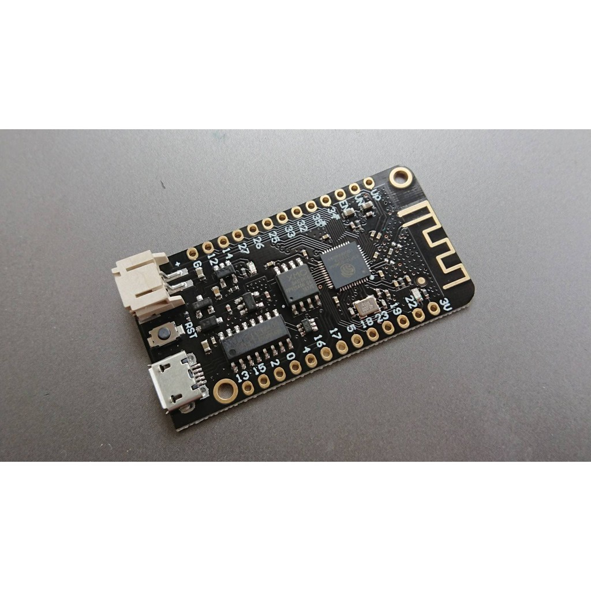           | 主開發版              |  115 |
| 端子線           |  PH2.0  |   1   | 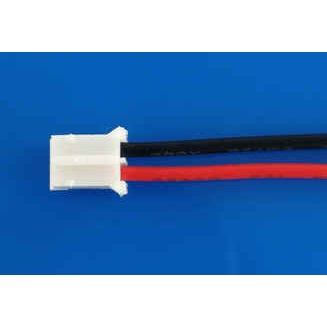                     | ESP32 電池端子        |    3 |
| pulse sensor     |    -    |   1   | 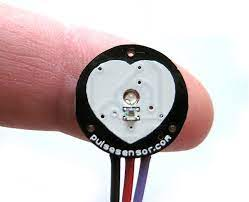       | 生物模擬感測器感應器  |   60 |
| 手機震動電機     |  1027   |   1   | 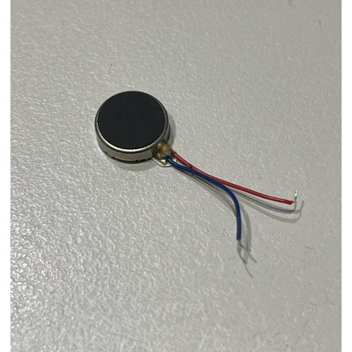 | 手機震動電機          |   13 |
| 按鈕             |    -    |   1   | 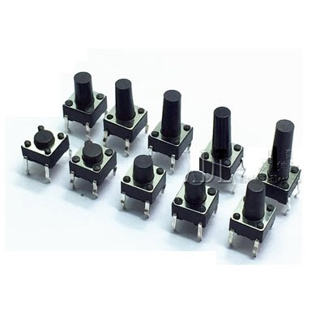                   | 與設備交互            |    3 |
| lm35             |    -    |   1   | 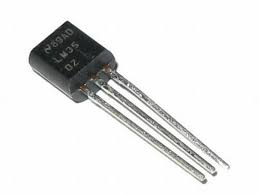                       | 溫度感測測器          |   12 |
| BMP180           |    -    |   1   | 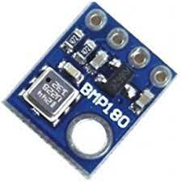                   | 溫度/大氣壓立感測測器 |   15 |
| 線材             |    -    |   1   | 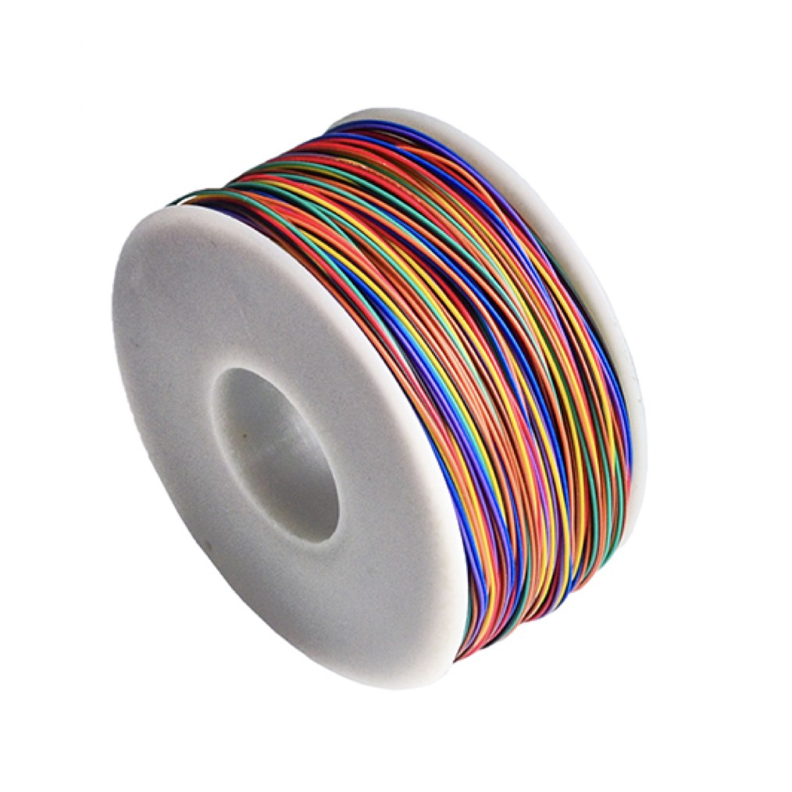                       | 連接模塊與模塊        |    2 |
| 外殼             |    -    |   1   | 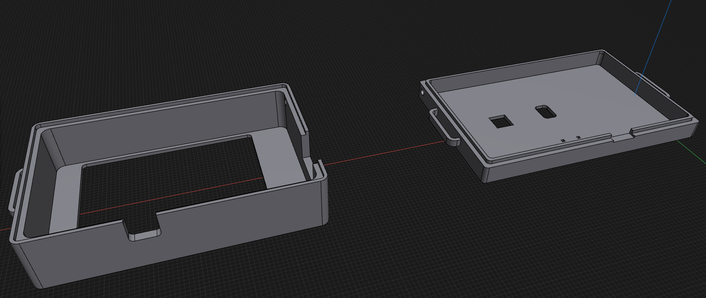         | 外殼                  |   20 |
| 2inch LCD        | 240×320 |   1   | 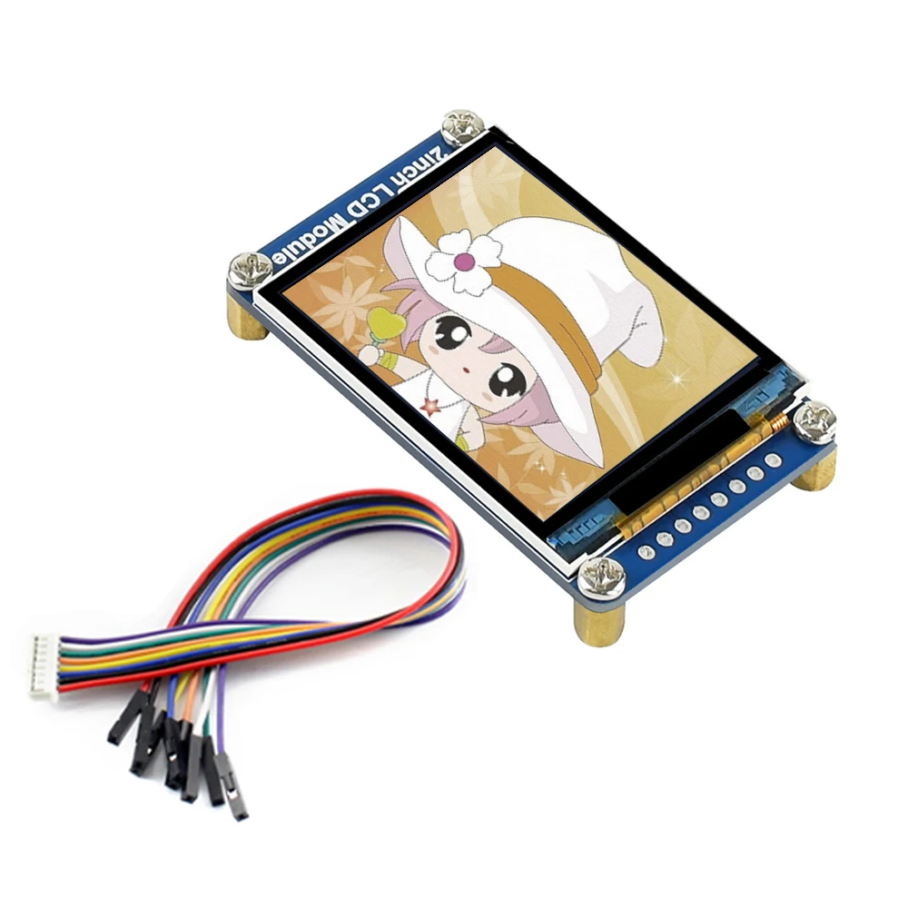             | 螢幕                  |  693 |
| 三軸重力傾斜模塊 | ADXL345 |   1   | 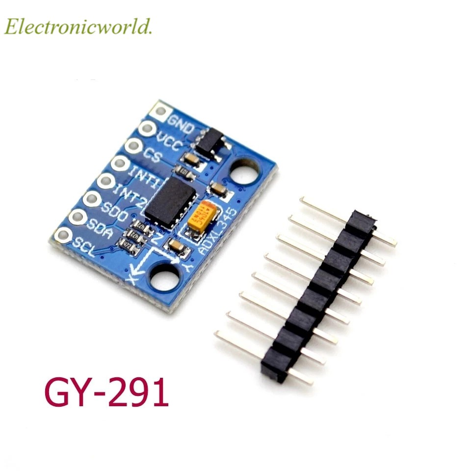                 | 三軸重力傾斜模塊      |   40 |

> 設備中的 2inch LCD 240×320 可置換成 240x240, 價格僅需要 138 元
> 其中 240x320 中有找到更便宜的版本: 334元

## 程式碼架構

由於程式碼檔案數量太多，將會取重點概述，如需查看完整的資料夾結構，請看 [list_files.txt](assets/list_files.txt)。
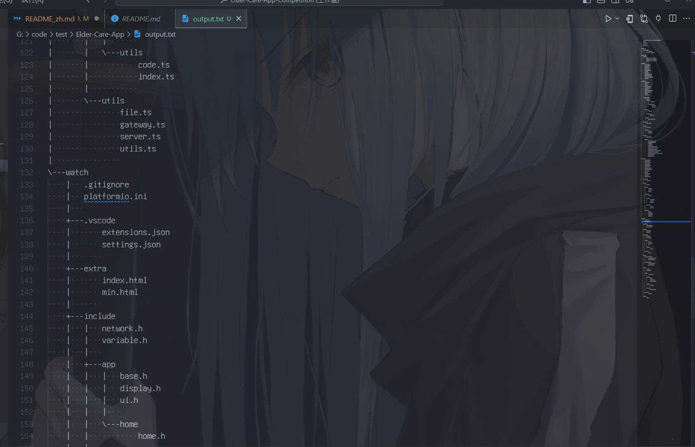

```yml
/  # 根目錄
├ 📂 .github/workflows      # Github actions 設定檔案
│ ├ frontend.yaml            # 前端網站編譯/部屬
│ └ releaser_server.yml      # 將伺服器程式碼編譯發布成 docker package
│
├ 📂 3D Model/watch         # 手錶的 3D 模型
│ ├ ElderCareClock_上蓋.stl  # 上蓋
│ ├ ElderCareClock_底蓋.stl  # 底蓋
│ └ ElderCareClock_All.stl   # 上蓋 + 底蓋
│
├ 📂 assets                 # README 中使用的圖片等靜態圖片/文件
│ └ [filename].*             # 圖片等靜態文件
│
├ 📂 frontend               # 網頁前端原始碼
│
├ 📂 server                 # 網頁後端原始碼
│
├ 📂 watch                  # 手錶原始碼
│
├ Elder-Care-App-Competition.code-workspace  # vscode 工作區設定檔
├ LICENSE                                    # 授權條款
└ README_zh.md                               # 本文件
└ README.md                                  # 概述
```

## 部分程式碼/演算法/想法參考

### Watch Reference

- [WiFiManager](https://github.com/tzapu/WiFiManager)
- [Heartbeat Detection](https://github.com/WorldFamousElectronics/PulseSensorPlayground)
- [Fall Detection Algorithm](https://maker.pro/arduino/tutorial/how-to-build-a-fall-detector-with-arduino)

## libraries

### Watch Libraries

- [lvgl](https://github.com/lvgl/lvgl)
- [ESPAsyncWebServer](https://github.com/me-no-dev/ESPAsyncWebServer)
- [Adafruit-BMP085-Library](https://github.com/adafruit/Adafruit-BMP085-Library)
- [Adafruit_ADXL345](https://github.com/adafruit/Adafruit_ADXL345)
- [TFT_eSPI](https://github.com/bodmer/TFT_eSPI)

<!-- https://www.apple.com/tw/shop/buy-watch/apple-watch -->
